# Using Amazon Macie to detect Sensitive Data in S3 buckets

## Introduction

In this lab, we will use Amazon Macie to detect sensitive data inside objects of an S3 bucket. The lab starts off with an S3 bucket populated with a test data, participants will then configure Macie and execute a Macie Job to analyze all objects in the bucket. Finally participants can review the findings from Macie against the source data.

This lab is set to Level 100, and participants are not required to specific knowledge of AWS. The lab will take ~10-15 minutes to complete.

## Setup Logging into Cloud9

Before we begin, we'll need to setup our lab to ensure we have an S3 bucket with the right test data. To do this, we'll use AWS Cloud9.

AWS Cloud9 is a cloud-based integrated development environment (IDE) that lets you write, run, and debug your code with just a browser. From our AWS Cloud9 instance we'll run a simple script that will setup our environment. From the AWS Console, search for Cloud9 in the AWS Console and Click on Cloud9.

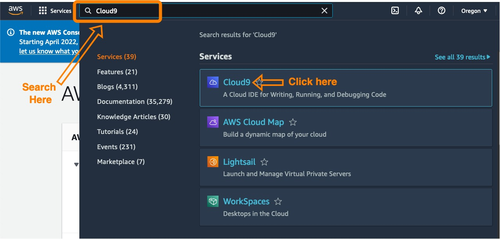

Once in the Cloud9 service select the Cloud9 environment that should already be pre-built for you, and click the Open IDE button for you to enter the IDE

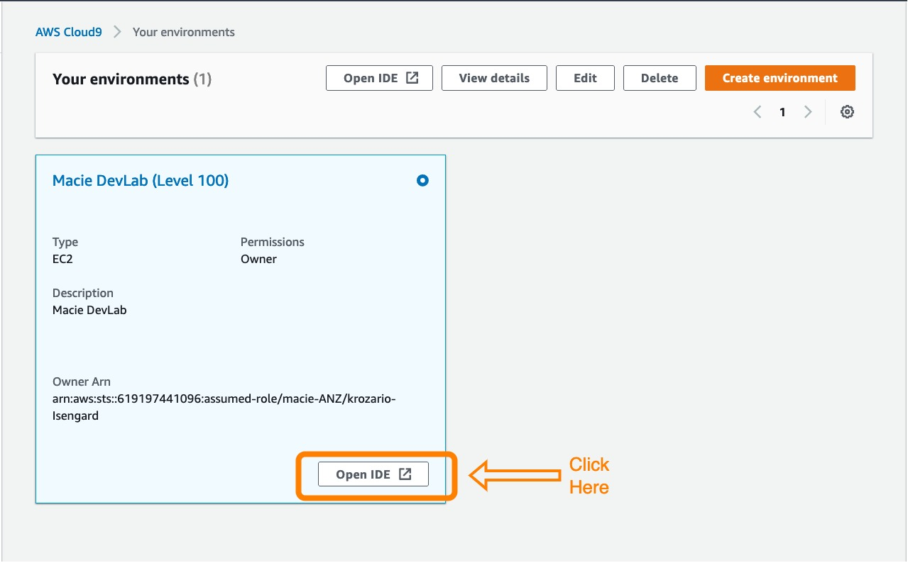

## Execute the startup script

Once inside Cloud9, we can begin the process of setting up our labs. Copy and paste the following code into the terminal of your Cloud9IDE (the terminal is bottom right of your screen), hit enter to execute the script, the script will take 10-15 seconds to execute.

    cd ~/environment && \
    rm -rf macie-ANZ-devlabs && \
    git clone https://github.com/keithrozario/macie-ANZ-devlabs.git && \
    cd macie-ANZ-devlabs && \
    pip3 install boto3 --quiet && \
    python3 setup_lab.py && \
    cd ~/environment

Once complete you should see a screen as below:

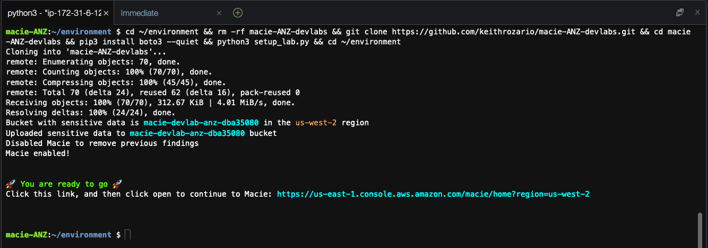

Congratulations, you're all done setting up the lab. You should now have a bucket in S3 prepopulated with test data from this repository (look under `test-data`).

You can click on the link present in your terminal to proceed to Macie. This will open Macie in a new browser tab, which will be useful as we'll come back to Cloud9 later.

## Running a Macie Job

Next we'll create a Macie Job, this job will analyze objects in any number of S3 buckets in this account to detect sensitive data.

To do this, select 'Get Started' and from then select Create Job under Analyze Buckets.

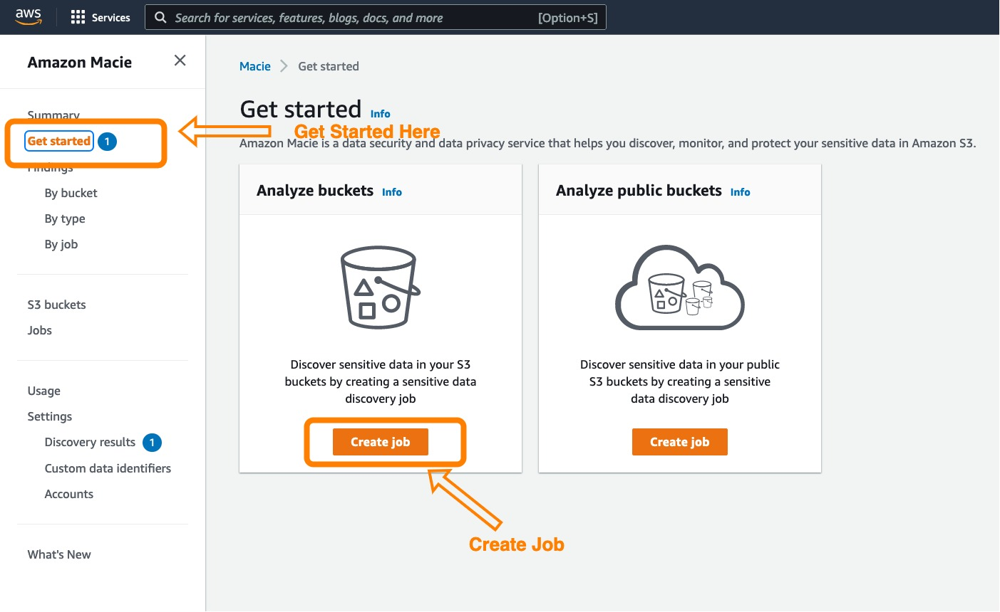

One the next screen, select 'Select specific buckets' to specify the bucket you wish to scan. And then select the bucket whose name begins with 'macie-devlab', this bucket has been prepopulated with test data for us to scan.

Once selected, click on 'Next'

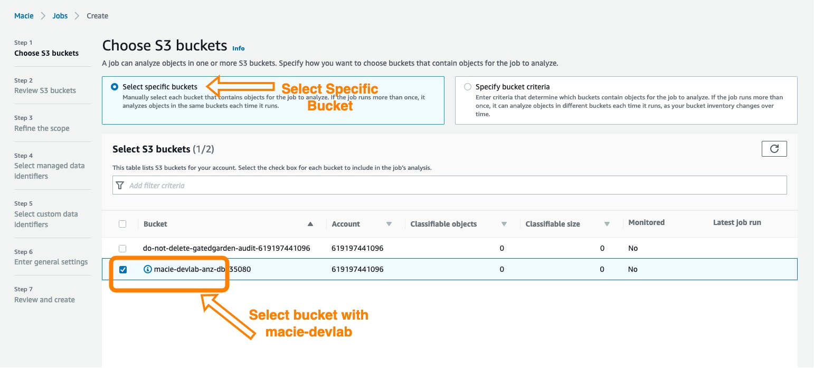

The next step is to review our buckets. You should see a single bucket with some estimated cost (the estimated cost might be $0.00). Click on Next.

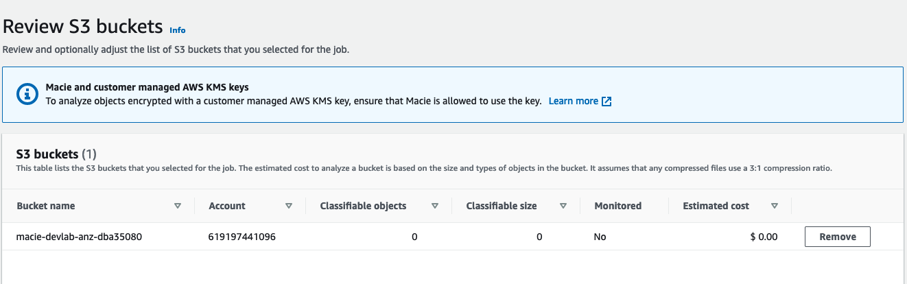

Next we'll need to refine the scope of our discovery job. For the purpose of this lab, we'll use a one-time job with 100% sampling depth. In your production environments, you might run daily jobs that scan only new objects. Similarly for very large buckets, e.g. buckets wih millions of objects, customers can choose a sampling depth to run analysis on a subset of the objects in the bucket.

For the purpose of the lab, the test data is small (<10 objects), so we'll run a one-time job with 100% sampling depth.

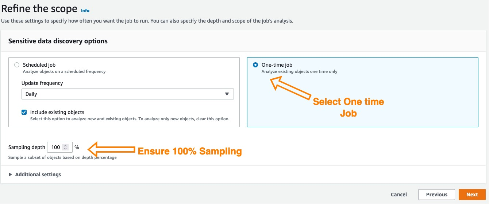

Now, we can select managed data identifiers. A set of built-in criteria and techniques that are designed to detect a specific type of sensitive data. Examples of sensitive data include credit card numbers, AWS secret access keys, or passport numbers for a particular country or region. These identifiers can detect a large and growing list of sensitive data types for many countries and regions. To view all the managed data identifiers, you can temporarily select the Include radio button. Just make sure you set the Selection type back to 'All' before proceeding to the next step.

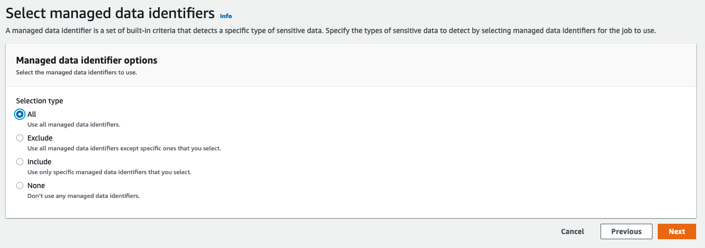

Additionaly we can also specify custom data identifiers to help Macie identify sensitive data outside of what is provided by the managed data identifiers. As part of the lab, we've pre-populated a custom data identifier called 'Gotham Passport Number', which will detect any data based on a regular expression we specified. Part of the test data will have one instance of this to demonstrate how Macie will analyze the finding.

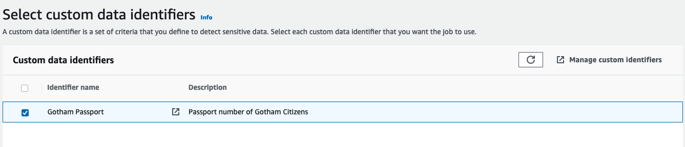

Now we'll enter a job name and optional description

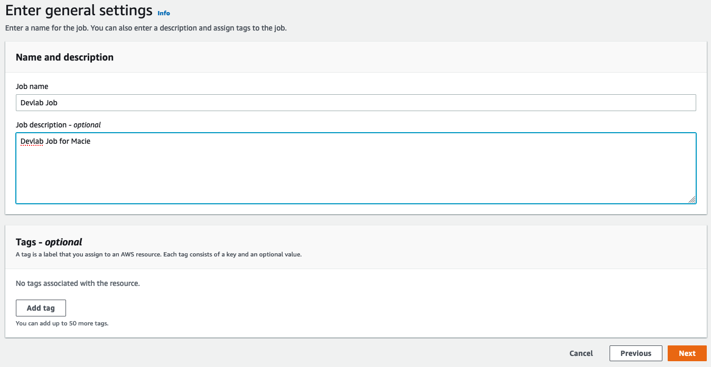

Finally we can review and hit submit. The job might not have any information on the bucket yet, and hence would estimate the cost to be $0.00, we can ignore this for now.

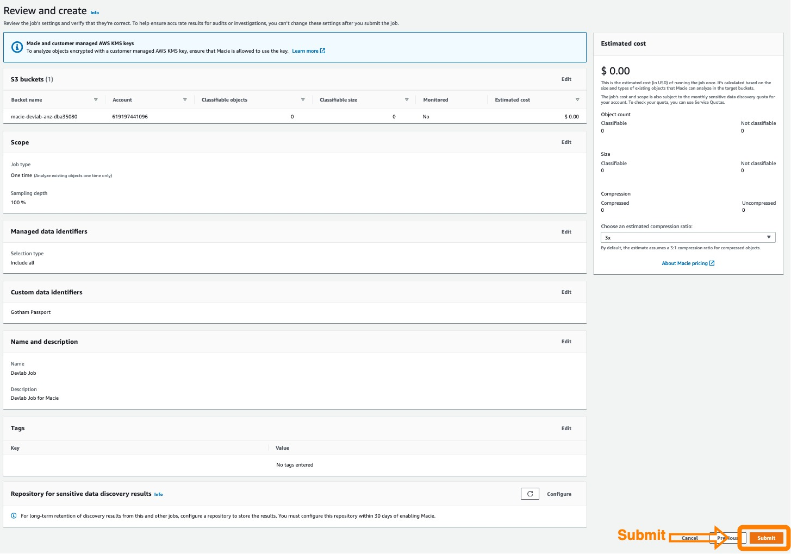

Congratulations, you've successfully initiated your first Macie Data Discovery Job. Macie is now analyzing data within the S3 bucket you specified to detect sensitive data, both based on the managed data identifiers, and the one custom data identifier we specified.

## Reviewing Test data

The Macie job will typically 5-10 minutes before completing. While we're waiting, let's use this time to analyze the test data in the bucket.

To do this, go back the Cloud9 IDE, and on the left side of the pane, you can select `macie-ANZ-devlabs/test-data`. Here you can see the files we've uploaded into our bucket for the scan. How many occurrences of sensitive data can you find?

## Reviewing Macie Finding