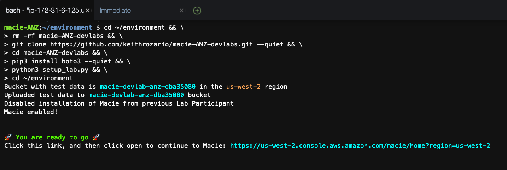

# Using Amazon Macie to detect Sensitive Data in S3 buckets

## Introduction

In this lab, we will use Amazon Macie to detect sensitive data inside objects of an S3 bucket. The lab starts off with an S3 bucket populated with a test data, participants will then configure Macie and execute a Macie Job to analyze all objects in the bucket. Finally participants can review the findings from Macie against the source data.

## Setup the lab

Before we begin, we'll need to setup our lab to ensure we have an S3 bucket with the right test data. To do this, we'll use AWS Cloud9.

AWS Cloud9 is a cloud-based integrated development environment (IDE) that lets you write, run, and debug your code with just a browser. From our AWS Cloud9 instance we'll run a simple script that will setup our environment. From the AWS Console, search for Cloud9 in the AWS Console and Click on Cloud9.

Once in the Cloud9 service select the Cloud9 environment that should already be pre-built for you, and click the Open IDE button for you to enter the IDE

Once inside Cloud9, we can begin the process of setting up our labs. Copy and paste the following code into the terminal of your Cloud9IDE (the terminal is bottom right of your screen), hit enter to execute the script, the script will take 10-15 seconds to execute.

    cd ~/environment && \
    rm -rf macie-ANZ-devlabs && \
    git clone https://github.com/keithrozario/macie-ANZ-devlabs.git && \
    cd macie-ANZ-devlabs && \
    pip3 install boto3 --quiet && \
    python3 setup_lab.py && \
    cd ~/environment

Once complete you should see a screen as below:

Congratulations, you're all done setting up the lab. Now we can move on to running a Macie job on our data. You can click on the link that should be present in your terminal to proceed to Macie. This will open Macie in a new browser tab, which will be useful as we'll come back to Cloud9 later.

## Running a Macie Job

